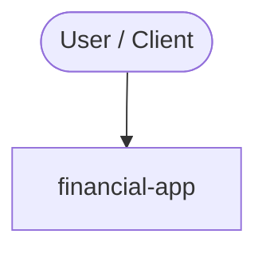

# financial-app
1. get the data from yfinance 
    1.1 import yfinance 
    
2. make a chart with matlibplot 
3.

<!-- ARCH-DIAGRAM:START -->

## Architecture

> Auto-generated architecture diagram. See [`docs/context-map.md`](docs/context-map.md) for the full context map (core application, containers/cloud, and database connections).

<!-- ARCH-DIAGRAM:END -->
